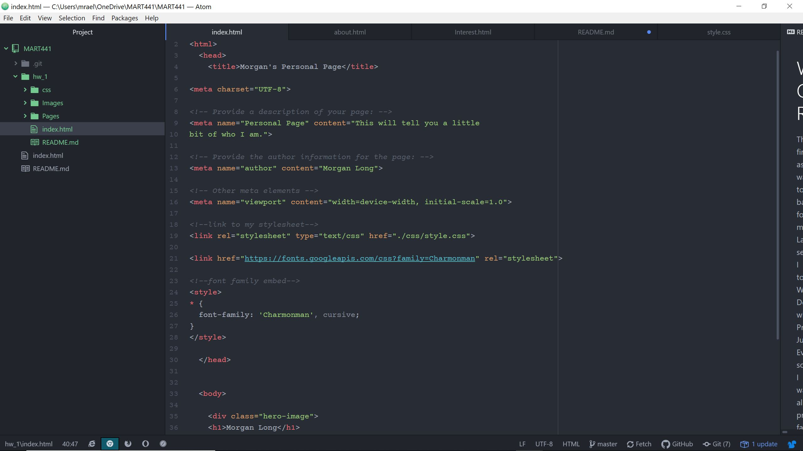

# Week One Readme
This first assignment wasn't to bad for me. Last semester I took Web Design with Professor Justine Evans, so I was already pretty familiar with the format of Atom and Github. I had to bush up on few things because I could quite remember how to do them. Such as, linking pages together. For this assignment I wanted to have the hero picture resemble me, so I chose an image with clothes. I am a huge shopper so it only seemed fitting. For the font I downloaded one form Google fonts and linked it to Atom. I chose a font that is a light stroke cursive. I went very simplistic with color and design because I really love simple black and white color pallets.

## Issues
I didn't come across any issues this week. I just had to brush up on a few topics again, but nothing to bad.

## Screenshot
 
